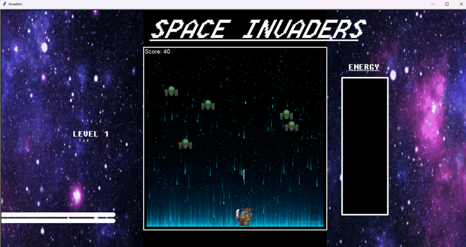
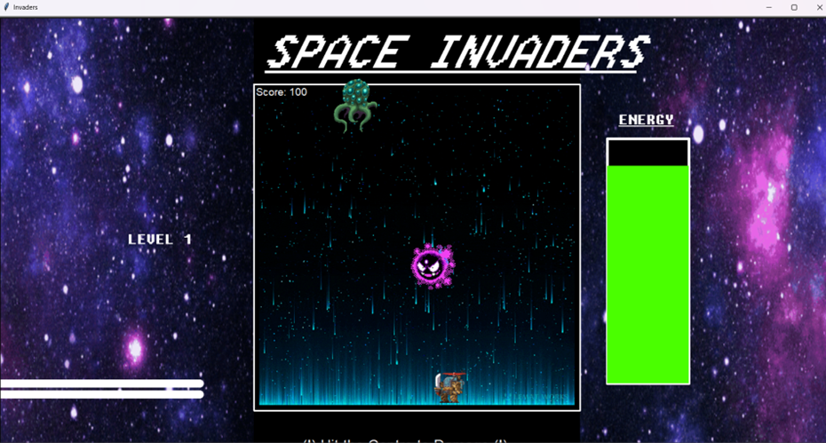
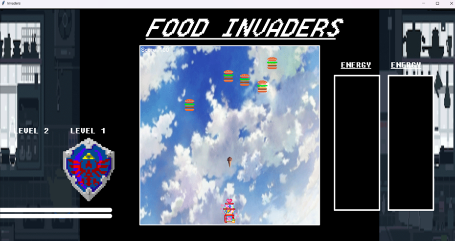

# Space Invaders — Pygame

Space Invaders is a classic arcade-style game implemented using Pygame, designed as a fun and interactive project during my game development learning journey. The game features progressive levels with increasing difficulty and a boss fight, combining shooting mechanics with player evasion tactics.

---

## Gameplay

- **Base Level:**  
  The player controls a spaceship that can move left and right along the bottom of the screen. Press the **Spacebar** to shoot lasers at descending alien invaders.  
  - Destroy 10 aliens to score 100 points and progress to the next level.  
  - Player must strategically dodge incoming alien fire while aiming accurately.

- **Boss Level:**  
  Upon reaching 100 points, the game transitions to a boss fight with a distinct theme.  
  - The boss features a visible hitbox and a health bar.  
  - The boss attacks the player with projectiles, requiring the player to evade while attacking.  
  - The player must hit the boss multiple times to reduce its health to zero and defeat it.  

- **Victory & Continuation:**  
  Once the boss is defeated, the theme changes to a celebratory tone, and the player receives a trophy animation. The game continues for further challenges or replayability.

---

## Features

- Smooth player movement with responsive controls.  
- Progressive difficulty with increasing enemy aggression.  
- Visual health bar and hitbox for boss engagement.  
- Thematic changes to enhance player immersion.  
- Score tracking and level progression logic.  
- Simple yet engaging 2D pixel art style using Pygame.

---

## Stages
### Stage 1 – Base Level

### Stage 2 – Boss Level

### Stage 3 – Trophy & Continuation

